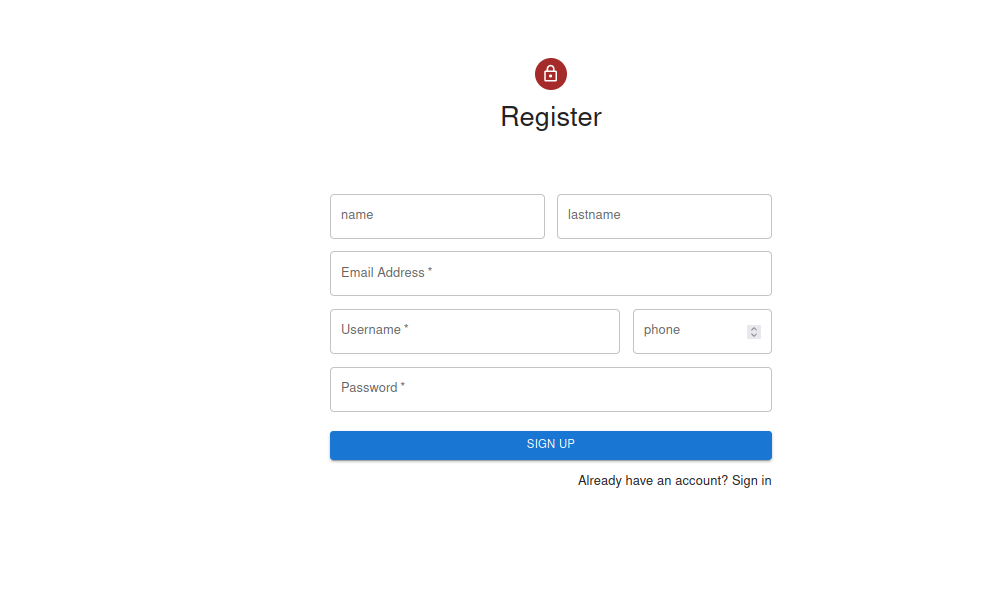
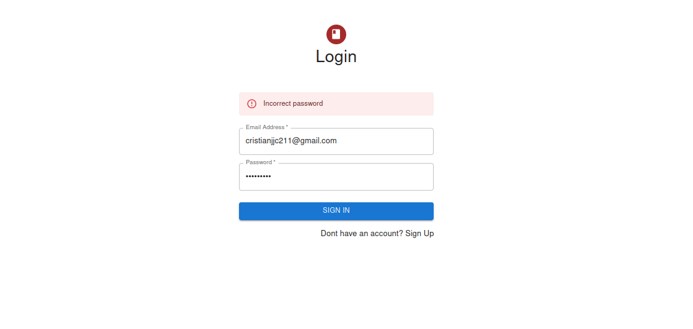
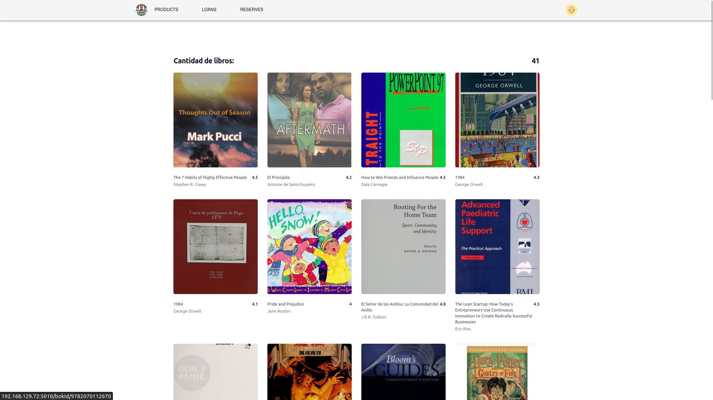
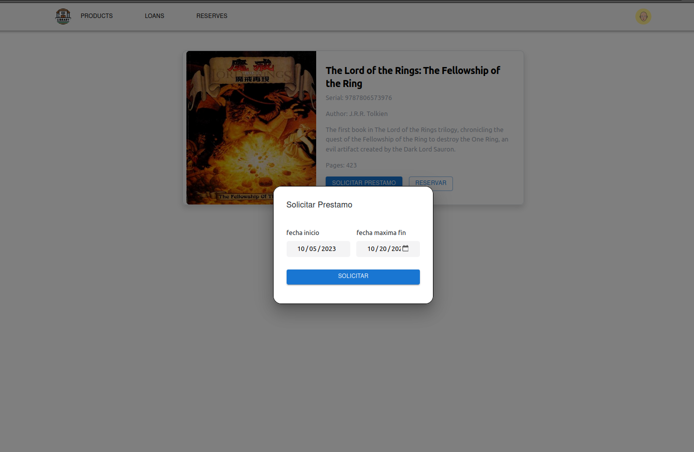
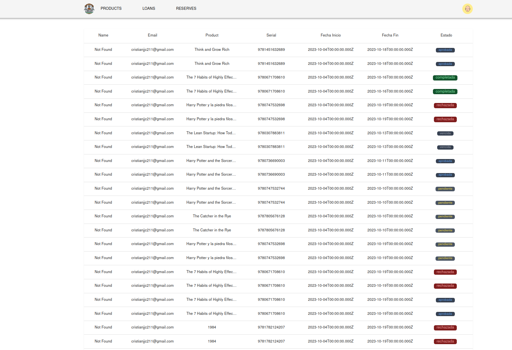
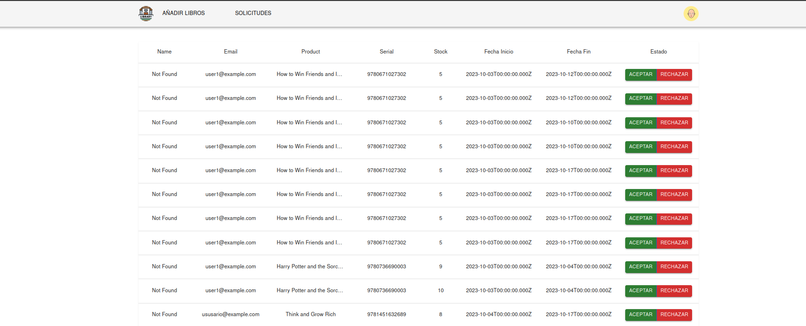
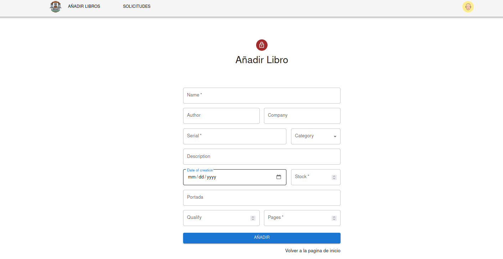
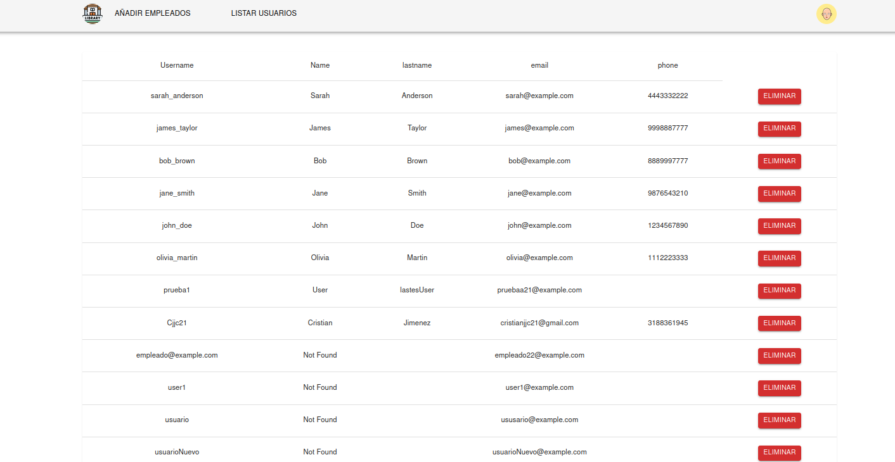
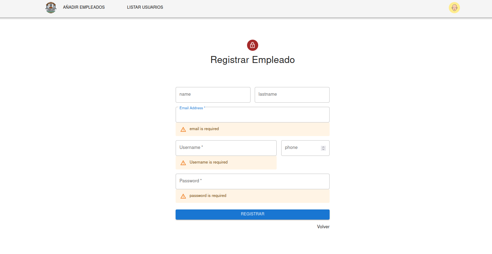

# LIBRARY CAMPUS 

------

## Descripción

La Biblioteca Virtual es una aplicación desarrollada utilizando el stack MERN que simplifica la gestión de préstamos y reservas de libros en una biblioteca. La aplicación ofrece una interfaz de usuario intuitiva y funcionalidades específicas para tres tipos de usuarios: usuarios regulares, bibliotecarios y administradores.

INFORMACION DEL PROYECTO

Esta documentación describe una aplicación de logica de negocio de una hamburgueseria construida utilizando Node.js, Express.js y MongoDB como base de datos. La aplicación cuenta con un sistema de autenticación basado en roles y utiliza las librerías `dotenv`, `express-session`, `jose`, `MongoDB`, `nodemon`, `express-rate-limit`, `passport`, `passport-http-bearer`.


## Tecnologías Utilizadas

- **MongoDB**: Base de datos NoSQL utilizada para almacenar información sobre libros, usuarios, préstamos y reservas.

- **Express.js**: Framework de backend que proporciona una API RESTful para la comunicación entre el cliente y la base de datos.

- **React**: Biblioteca de frontend para construir la interfaz de usuario interactiva y dinámica de la aplicación.

- **Node.js**: Entorno de tiempo de ejecución del lado del servidor para ejecutar el servidor web y la lógica de la aplicación.

  

## Requisitos previos

- Node js instalado en tu maquina (Recomendada v18.16.0)

  - Instalación de Node usando NVM para Linux => nvm install v18.16.0

  - Instalación de Node usando NVM para Windows => https://github.com/coreybutler/nvm-windows

  - Verifica si se instaló correctamente:

    ```bash
    node -v
    npm -v
    ```

- MongoDB instalado y configurado con las credenciales necesarias para conectarse a la base de datos.

  

## Instalación

**Repositorio a clonar:**

```bash
https://github.com/C-jimenez21/CAMPUS_LIBRARY
```

## Instrucciones

1. Descarga las dependencias y dependencias de desarrollo, usar: `npm i` o `npm update`

2. Una vez descargado nodejs y las dependencias crear el archivo **.env**, lo siguiente es la estructura que debe usar, tambien está en .env.example

   ```gherkin
   ATLAS_USER="C-jimenez21"
   ATLAS_PASSWORD="admin21"
   ATLAS_DB="Campus_library"
   VITE_PORT_BACKEND = 5006
   VITE_PORT_FRONTEND = 5010
   VITE_HOSTNAME = 'http://127.10.10.10:5050/'
   JWT_SECRET="jwt_secret"
   ```

3.  iniciar el backend: `npm run dev`

   El servidor debería iniciarse y estar listo para recibir solicitudes en la dirección   `http://127.10.10.10:5050/` (puedes cambiar el puerto en el archivo `.env` si lo deseas).

4. Establezca conección a atlas en mongo, luego dirijase a la carpeta **database**, seleccione la carpeta schema y ejecute el archivo (tenga en cuenta cambiar el cluster-code de acuerdo a su atlas)

   `mongodb+srv://<user>:<password>@cluster0.<clusterCode>.mongodb.net/`


## **Paginas **

LOGIN / REGISTER

En estas paginas el usuario se puede loguear o registrarse como usuario

​	

​	


------


## **Interface Usuario**

A continuación, se describe la interface sobre el rol usuario, empezando por la pagina principal la cual renderiza el listado de libros

​	


Para ver mas detalles sobre el libro, puedes clicar sobre él y desde allí puedes realizar la reserva





Aqui podras solicitar ya sea una reserva o solicitar un prestamo, si deseas solicitar un prestamo deberas seleccionar la fecha fin en la que devolveras el libro, esta solo te dejara un plazo maximo de 15 dias para tomar como fecha maxima 

Pasando a la reserva, esta solo te permite solicitar reservar a mas tardar 1 sem


Si cualquiera de estas consultas va bien, se redireccionara a la pagina respectiva, ya sea reservas o solicitud de prestamo

 LOANS



Alli se puede ver el estado de las diferentes Solicitudes de prestamo que hay hecho el usuario hasta la fecha:


## **Interface Empleado**

A continuación, se describe la interface sobre el rol Empleado, empezando por la pagina principal la cual renderiza las peticiones de los usuarios sobre el prestamo. 

Este puede aceptarlas o rechazarlas, si lo acepta se descontara automaticamente del stock del libro la unidad prestada y se cambiara el estado de pendiente a aprobado, si por el contrario se cancela la peticion este solo actualizara el estado de la reserva a rechazada




Tambien tiene la posibilidad de añadir los libros 





## **Interface Admin**

A continuación, se describe la interface sobre el rol Admin, empezando por la pagina principal la cual renderiza la lista de usuarios registrados




Tambien tiene la posibilidad de registrar los Empleados

 


## **Endpoints y Métodos**

A continuación, se describen los endpoints disponibles en la aplicación junto con sus respectivos métodos HTTP y formatos de datos requeridos.

------

## Endpoint: *Usuario*

| CONSULTA                                                     | URL           | METHOD |
| ------------------------------------------------------------ | ------------- | ------ |
| Trae toda la data de los usuarios                            | /api/User     | GET    |
| Trae toda la data de un usuario en especifico usando el email | /api/User/:id | GET    |
| Permite crear un usuario                                     | /api/User     | POST   |
| Elimina el cliente                                           | /api/User:id  | DELETE |


## Endpoint: *Loans*

| CONSULTA                                                     | URL            | METHOD |
| ------------------------------------------------------------ | -------------- | ------ |
| Trae toda la data de los prestamos                           | /api/Loans     | GET    |
| Trae toda la data de un prestamos en especifico usando el id | /api/Loans/:id | GET    |
| Permite crear una prestamo                                   | /api/Loan      | POST   |
| Elimina el prestamo                                          | /api/Loan/:id  | DELETE |


------

## Contacto

Si tienes alguna pregunta o comentario sobre esta aplicación, no dudes en ponerte en contacto con nosotros a través de  [cristianjj21@gmail.com](mailto:cristianjj21@gmail.com). ¡Esperamos que disfrutes usando nuestra aplicación!